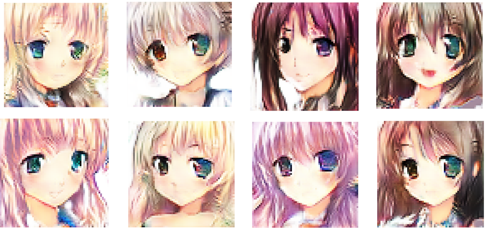
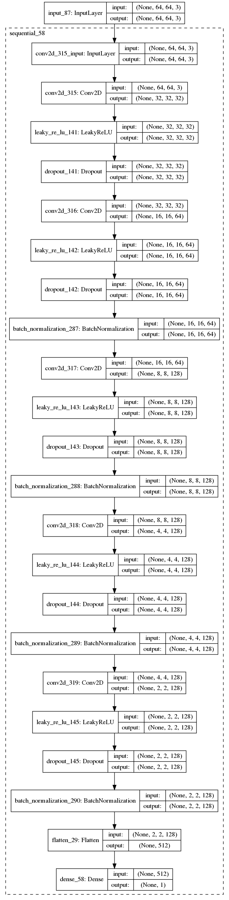

# anime-GAN

Fun project for generating anime characters using Deep Convolutional Generative Adversarial Networks (DCGAN). Picture above shows some results generated by anime-GAN.

Implemented with:

  * Python 2.7
  * Tensorflow 1.13.1
  * Keras 2.2.5

Dataset:
  * Should be under a folder named: /data
  * https://github.com/pavitrakumar78/Anime-Face-GAN-Keras/blob/master/anime_dataset_gen.py
  * https://www.kaggle.com/aadilmalik94/animecharacterfaces
  * Checkout https://github.com/nikitaa30/Manga-GAN
  
References:
  * https://github.com/jacobgil/keras-dcgan
  * https://github.com/DataSnaek/DCGAN-Keras

Models:

  * Discriminator and Generator:
  
   
  
Generates/Saves images per 200 epochs under /images and /models folders.
  
  
